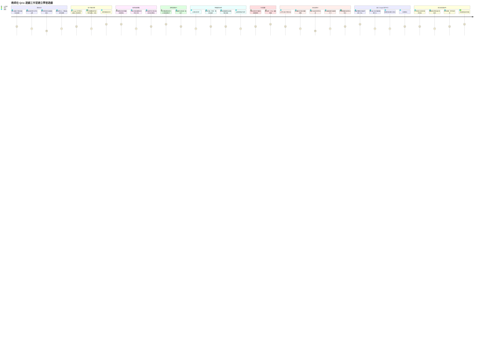
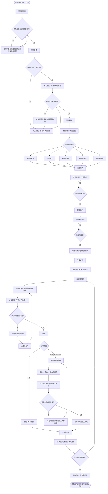

```mermaid
journey
    title 教師在 Qrio 遊戲工作室建立學習遊戲
    section 開始之前
      進入遊戲工作室並建立新遊戲: 4: 教師
      確認來源文件可合法上傳: 3: 教師
      移除學生姓名與敏感資料: 2: 教師
      確認學校 AI、隱私與發布規範: 3: 教師
    section 寫下學習目標
      從 Google 文件匯入或輸入學習目標: 4: 教師
      以可觀察動詞完成「學生能夠」句型: 3: 教師, Q 助理
      選擇年級與科目: 5: 教師
    section 配對遊戲類型
      依目標動詞取得推薦遊戲類型: 5: Q 助理
      比較五種遊戲類型的學習行動: 3: 教師
      選定讓學生行動並看見後果的類型: 4: 教師
    section 發想遊戲點子
      依目標與類型產生 10 個遊戲點子: 5: Q 助理
      重新產生或挑選一個點子: 4: 教師
    section 準備製作說明
      上傳來源文件: 3: 教師
      確認年級、目標、類型與點子: 4: 教師
      確認遊戲規範為遊戲而非測驗: 4: 教師
      檢視完整製作指令: 3: 教師
    section 生成遊戲
      分析來源文件並設計遊戲機制: 4: Q 助理
      產出單一 HTML 遊戲檔案: 5: Q 助理
    section 試玩與修正
      以學生身分完整試玩: 4: 教師
      故意嘗試失敗並重新挑戰: 3: 教師
      檢查內容是否符合來源: 2: 教師
      測試鍵盤操作與螢幕尺寸: 3: 教師
      回報問題並取得修正版本: 4: 教師, Q 助理
    section 嵌入 Google 協作平台
      複製完整程式碼或下載 HTML: 5: 教師
      插入嵌入程式碼並調整大小: 3: 教師
      預覽頁面並再次測試: 3: 教師
      發布網站: 4: 教師
    section 成功檢查與反思
      以學生身分檢查已發布頁面: 4: 教師
      確認網站對象與分享設定: 3: 教師
      記錄觀察、思考與好奇: 4: 教師
      將遊戲指派給班級: 5: 教師, 學生
```

```mermaid
flowchart TD
    A([進入 Qrio 遊戲工作室]) --> B[建立新遊戲]
    B --> C{開始之前三項確認皆完成?}
    C -- 否 --> C1[移除學生個資並確認來源授權與學校規範] --> C
    C -- 是 --> D[學習目標]
    D --> D1{從 Google 文件匯入?}
    D1 -- 是 --> D2[匯入年級、科目與學習目標] --> E
    D1 -- 否 --> D3[輸入年級、科目與學習目標] --> E
    E{目標含可觀察動詞?}
    E -- 否 --> E1[Q 助理提示改寫為可觀察動詞] --> D3
    E -- 是 --> F[遊戲類型]
    F --> F0[依動詞標示推薦類型]
    F0 --> G{選擇遊戲類型}
    G --> G1[預測與解釋]
    G --> G2[依序操作]
    G --> G3[觀察與辨識]
    G --> G4[判斷與說理]
    G --> G5[創作與設計]
    G1 & G2 & G3 & G4 & G5 --> H[遊戲點子]
    H --> H1[Q 助理產生 10 個點子]
    H1 --> H2{有合適的點子?}
    H2 -- 否 --> H1
    H2 -- 是 --> I[製作說明]
    I --> I1[上傳來源文件]
    I1 --> I2{檔案可讀取?}
    I2 -- 否 --> I1
    I2 -- 是 --> I3[確認遊戲規範與製作指令]
    I3 --> J[生成遊戲]
    J --> J1[產出單一 HTML 遊戲 v1]
    J1 --> K[試玩與修正]
    K --> K1[完整試玩並嘗試失敗與重新挑戰]
    K1 --> K2[切換電腦、平板、手機尺寸]
    K2 --> K3{試玩檢查全部通過?}
    K3 -- 否 --> K4[向 Q 助理回報問題]
    K4 --> K5[產生新版本] --> K1
    K3 -- 是 --> L[發布]
    L --> L1{發布方式}
    L1 -- 下載 --> L2[下載 HTML 檔案]
    L1 -- Google 協作平台 --> L3[複製完整程式碼]
    L3 --> L4[插入 → 嵌入 → 嵌入程式碼]
    L4 --> L5[貼上程式碼並調整嵌入區大小]
    L5 --> L6{預覽中遊戲正常運作?}
    L6 -- 否 --> L7[向 Q 助理要求相容嵌入的修正版] --> L3
    L6 -- 是 --> L8[發布網站並填入網址]
    L2 --> M
    L8 --> M[成果與反思]
    M --> M1[以學生身分檢查已發布頁面]
    M1 --> M2{成功檢查全部通過?}
    M2 -- 否 --> K
    M2 -- 是 --> M3[記錄觀察、思考與好奇]
    M3 --> N([遊戲加入遊戲庫並可指派給班級])
```
